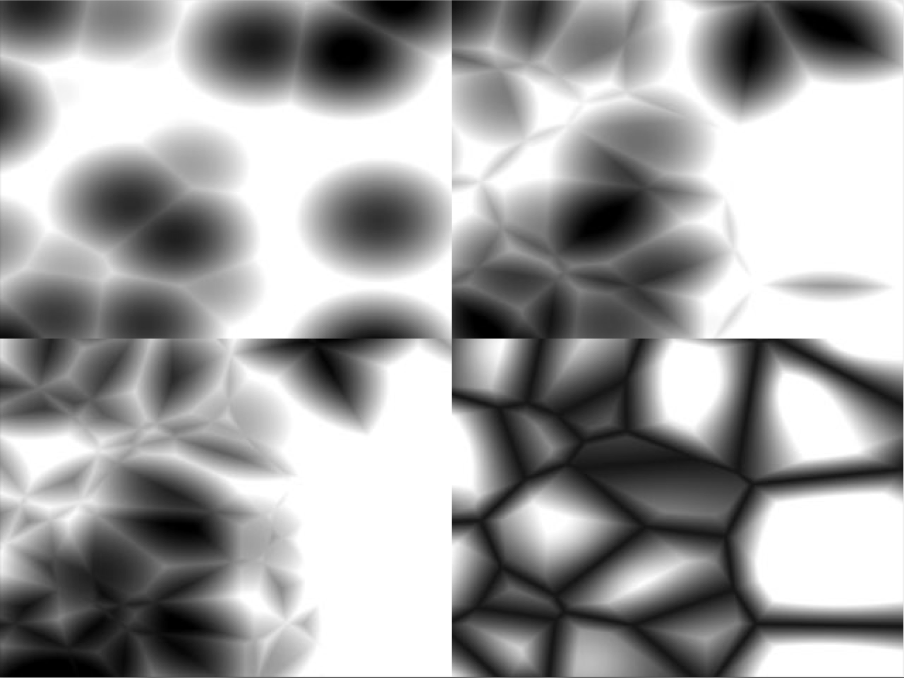

---

title: Cellular Noise

type: algorithm

description: Cellular noise is a surface-texturing algorithm based on a partitioning of space into random cells.

creator: Steven Worley

rights: Public Domain (CC0)

keywords: noise, organic, surface-texturing

---

# Cellular Noise

Image credit: [Steven Worley](https://dl.acm.org/doi/abs/10.1145/237170.237267)

## Overview

Cellular Noise was introduced by Steven Worley at SIGGRAPH 1996 as a complement to Perlin Noise for the generation of organic and natural-looking textures for 2D and 3D computer graphics. Cellular Noise uses randomly distributed _feature points_ scattered in space, and defines the colour value of every other point in space as a function of its distance to its nth closest feature point. 

## How it Works

Plain implementation works as follows:

1. Scatter _n_ feature points across the space 
2. For each pixel in the space, calculate the distance to all feature points
3. Return the distance to the nth closest feature point
4. Calculate the pixel value based on that distance

This implementation is not efficient. Your computer will struggle with more than a few feature points. A proposed optimisation, that makes use of the multi-threaded capabilities of modern GPUs is to tile the space.

1. Tile space into _n_ tiles
2. Scatter _n_ random feature points, one per tile
3. For each pixel in the space, calculate distance to local feature point, as well as to feature points in neighbouring tiles
4. For each pixel, return distance to nth closest feature point
5. Calculate pixel value as a function of distance

## References

1. Cellular Noise original paper: <https://dl.acm.org/doi/abs/10.1145/237170.237267>
2. Cellular Noise article on _The Book of Shaders_ <https://thebookofshaders.com/12/>