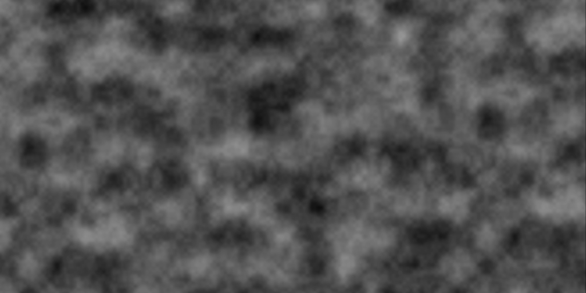
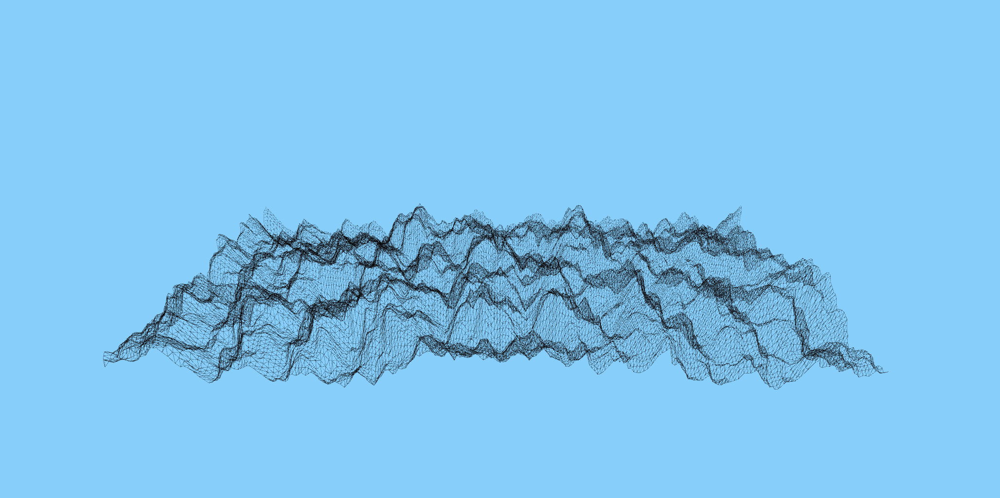

# Perlin Noise

Perlin Noise, developed by Ken Perlin in 1983, is an algorithm that generates gradient noise, which means it creates a continuous flow of random values. Unlike simple random noise, which can be chaotic and harsh, Perlin Noise produces smoother, more organic patterns, making it ideal for simulating natural elements like landscapes, clouds, and textures.

It works by blending between random values at specific grid points, resulting in a visually pleasing flow between them. This algorithm is widely used in generative art, animation, and game development because of its ability to add realism to artificial creations.

## How it works

```
General algorithm for Perlin Noise, given an input point

1. Define grid points surrounding the input point
2. Assign random gradients to the grid points
3. Compute the dot products between gradients and the distance to the point
4. Smoothly interpolate between these values
```

Note that the level of detail and complexity in the generated pattern is affected by the octave count. Each "octave" represents a layer of noise at a different frequency (how quickly the pattern changes) and amplitude (how strong the changes are). The more octaves you add, the more layers of detail get stacked on top of each other. This makes the pattern more complex and visually interesting. Try changing the octave count in the live example below.

## A live example

<iframe height="500" style="width: 100%" scrolling="no" title="Perlin Noise" src="https://codepen.io/camilocruzg/embed/rNzOqMN" frameborder="no" loading="lazy" allowtransparency="true" allowfullscreen="true"></iframe>

## Examples

Perlin noise can be used to create cloud-like textures:



Or landscapes, such as this mountain range:


