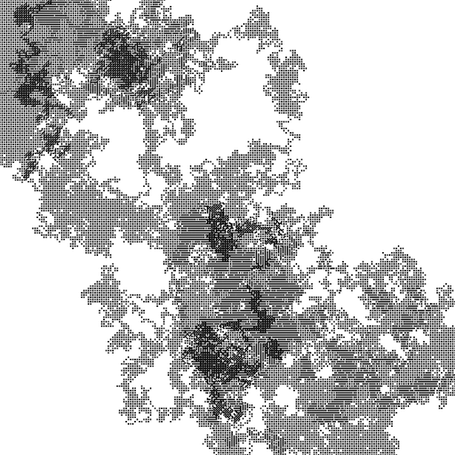

# Random Walk

In generative art, random walks serve as a powerful method for introducing an element of chance into creative systems. This allows for the emergence of unpredictable yet intriguing patterns. At its core, a random walk involves a series of successive, random steps through a mathematical space, where each new position depends on the one before it, but the direction is determined by chance.

This concept, borrowed from statistics, provides a rich framework for creating fluid, evolving designs that mimic organic processes like the wandering of particles or the movement of organisms. By harnessing the stochastic nature of random walks, generative artists can craft unique, dynamic compositions that defy rigid structures, embracing a balance between order and randomness. This approach is particularly valuable in exploring themes such as chaos, evolution, and complexity within creative systems.

## A live example

In this live example, random walkers begin at a common origin then gradually diverge, resulting in an organic movement through the space:

<iframe height="560" style="width: 90%" scrolling="no" title="L-System" src="https://codesandbox.io/embed/xqlm27?view=split&module=%2Fsketch.js&hidenavigation=1" frameborder="no" loading="lazy" allowtransparency="true" allowfullscreen="true"></iframe>
