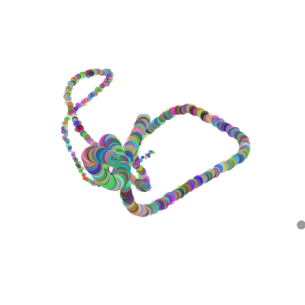

# Steering Behaviours

Steering algorithms are designed to control the movement of agents, making them respond intelligently to their environment. Unlike random walks, where movement is unpredictable, steering algorithms calculate the direction and speed based on certain goals or rules.

For example, an agent might "seek" a target by moving toward it or "flee" from a danger by moving away. These behaviors are blended together to create more complex actions, such as following a path, avoiding collisions, or even flocking with other agents.

Steering algorithms are often used in generative art to simulate lifelike movements, such as fish swimming in a school or birds flying in formation. By giving each agent its own goals and abilities, artists can create dynamic, evolving patterns that feel organic and responsive to the environment.

## A live example

Move your mouse pointer and watch the boid follow:

<iframe height="560" style="width: 90%" scrolling="no" title="L-System" src="https://codesandbox.io/embed/zn4fwf?view=split&module=%2Fsketch.js&hidenavigation=1" frameborder="no" loading="lazy" allowtransparency="true" allowfullscreen="true"></iframe>
