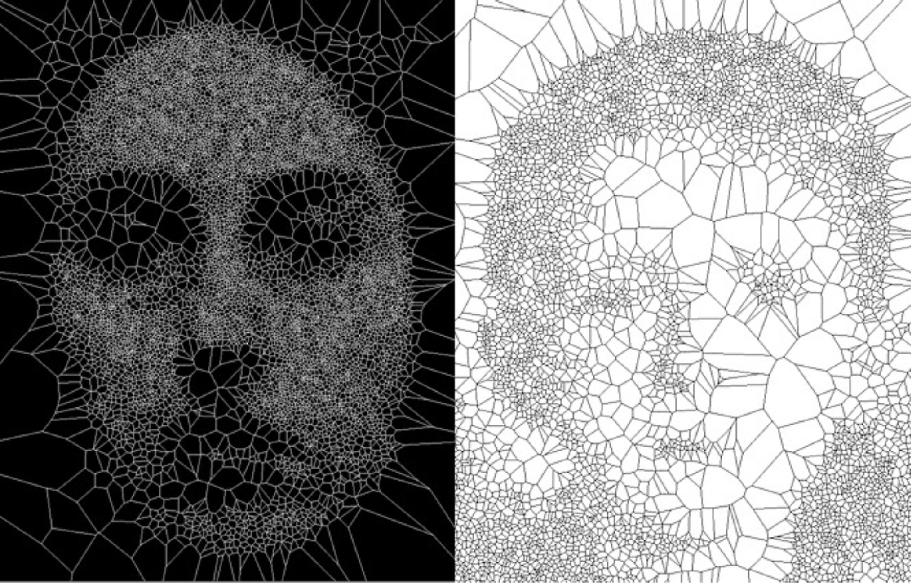
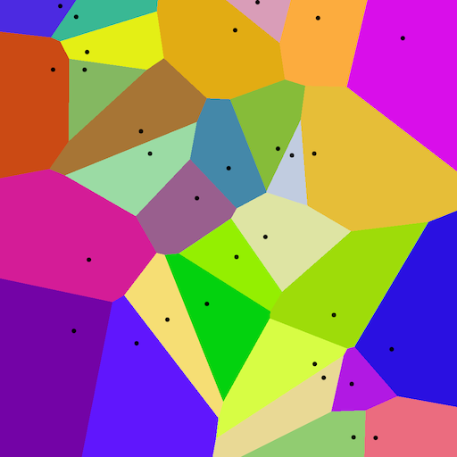
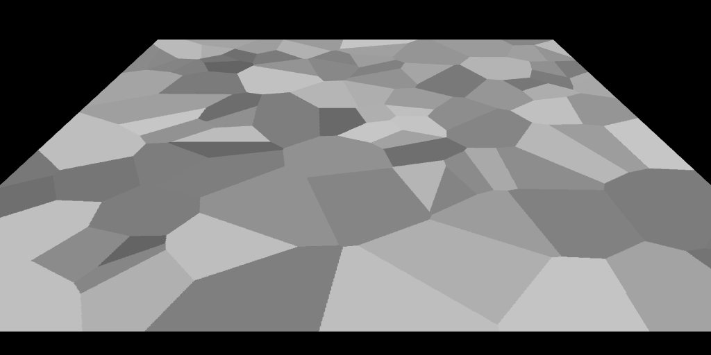

# Voronoi Tessellation

Image credit: [Golan Levin, from Segmentation and Symptom](https://www.flong.com/archive/projects/zoo/index.html)

## Overview

Voronoi tessellations are geometric patterns that mimic structures we often see in nature, like the way cells or crystals are formed. These patterns emerge when different areas of space find balance, each centered around a point. In computer art, Voronoi tessellations are used as a way to divide space into regions based on an arbitrary set of points, known as "sites." Each region contains all the points closest to its site, creating a patchwork of shapes. This process is especially popular in generative art because it produces interesting, organic-looking designs that can resemble natural forms or abstract geometric compositions.

## How it works

Starting in a 2D plane like a square or rectangle:

1. Seed the space with _n_ points. These will be the centers of the different regions.
2. For every point on the plane, measure how far it is from each of the seeds.
3. Each point on the plane is assigned to its closest seed. All the points closest to a particular seed form that seed's region (or Voronoi cell).
4. Draw straight lines that separate the different seed regions. The result will be _n_ regions that fit together like puzzle pieces.

## Examples

This example shows different coloured Voronoi cells with their associated seed points:

Here we see a plane in a 3D environment, with a Voronoi pattern:

