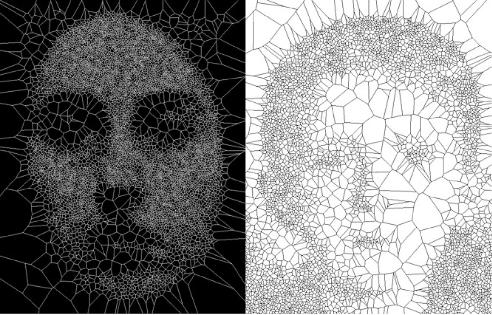

---

title: Voronoi Tesselation

type: algorithm

description: Voronoi Tesselation is a procedure used to subdivide a plane into regions based on specific points called seeds.

creator: Georgy Voronoy

rights: Public Domain (CC0)

keywords: tesselation, artist-friendly

---

Voronoi Tesselation
===================

Image credit: [Golan Levin, from Segmentation and Symptom](https://www.flong.com/archive/projects/zoo/index.html)

# Overview

Geometric constructions that appear frequently in nature (cells and crystals), as compressed spatial units find equilibrium. From a computational perspective, Voronoi Tesselation is a space filling algorithm that takes an arbitrary set of points, know as _sites_, as input, and returns a series of regions, in which every point is closer to one _site_.

# How it works

1. Seed the space with _n_ site points.
2. For every other point in the space, measure distance to all site points and return smallest distance.

# Examples in Action

# References

1. 
2. 