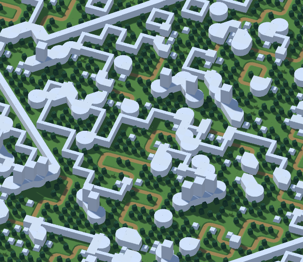
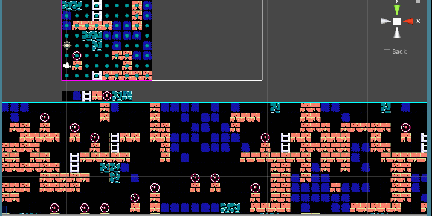

# Wave Function Collapse

Image credit: [selfsame on itch.tio](https://selfsame.itch.io/)

## Overview

[Wave Function Collapse](https://github.com/mxgmn/WaveFunctionCollapse) is a general randomised space-filling algorithm. It takes an arbitrary tiled input and populates a tiled output based on existing frequencies of tiles and neighbouring tiles. It was created by Maxim Gumin in 2016 released on GitHub under the MIT License.

## How it works

As the name suggests, Wave Function Collapse was inspired by quantum states, where outcome is not determined until observed. It's not an overly complex algorithm, and the process of tuning is artist friendly, making this algorithm suitable for a variety of generative applications.

To explain how Wave Function Collapse works, let's assume we're generating an image of a simple cave map. The algorithm only needs an input image containing all the possible elements, such as rocks, ladders, hazards, lights, and empty spaces.

Image Credit: [Joseph Parker](https://www.procjam.com/tutorials/wfc/)

Assuming the output is a large map, the algorithm goes through the following:

1.  Divide the input image into square tiles, and register the frequency of identical tiles. The more frequent a tile appears, the more likely it will be generated.

2.  For each identical tile, frequencies for possible neighbours are also registered.

3.  Divide the output image (can be larger or smaller) with square tiles of the same size.

4.  A random tile on the output image is randomly filled with an observed starting input tile. From here, a search algorithm is carried out to "discover" the remaining output tiles:

5.  For each neighbour of the observed tile, randomly fill it according to the input tiles calculated in step 2.

6.  Repeat this process until all tiles have been observed.

The following authors provide a good explanation or tutorial for the algorithm in depth:

- [Robert Heaton](https://robertheaton.com/2018/12/17/wavefunction-collapse-algorithm/)

- [TRASEVOL_DOG](https://trasevol.dog/2017/09/01/di19/)

- [Joseph Parker](https://www.procjam.com/tutorials/wfc/)

## Examples in action

<iframe src="https://oskarstalberg.com/game/wave/wave.html" title="WaveFunctionCollapse example by Oskar Starberg" width="100%" height="600"></iframe>

### In the wild

Wave Function Collapse has been adopted in a number of commercially successful games, notably:

- [Caves of Qud](https://www.cavesofqud.com/), for random dungeon generation ([YouTube](https://www.youtube.com/watch?v=fnFj3dOKcIQ))

- [Bad North](https://www.badnorth.com/), for random island generation

- [Townscaper](https://www.townscapergame.com/), for random city and building generation

### Other examples

- [Super Mario WFC](https://observablehq.com/@makio135/super-mario-wfc) is a Javascript implementation running on Observables.

- [unity-wave-function-collapse](https://selfsame.itch.io/unitywfc) is a Unity port of the algorithm.

- [WFC Piano Roll](https://github.com/bbaltaxe/wfc-piano-roll) is an audio generation experiment.

- [WFC GitHub Page](https://github.com/mxgmn/WaveFunctionCollapse) for a complete list of ports and more examples

## References

1.  WaveFunctionCollapse GitHub Page: <https://github.com/mxgmn/WaveFunctionCollapse>

2.  WFC explanation: <https://www.gridbugs.org/wave-function-collapse/>
