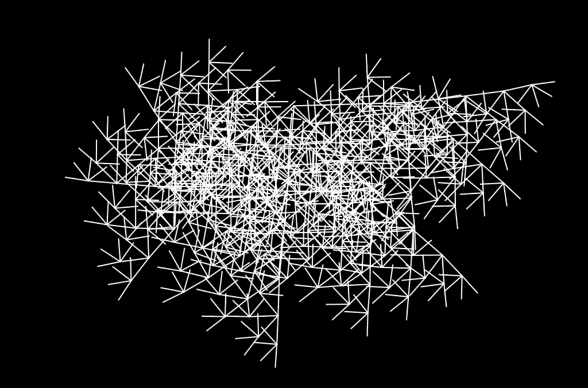
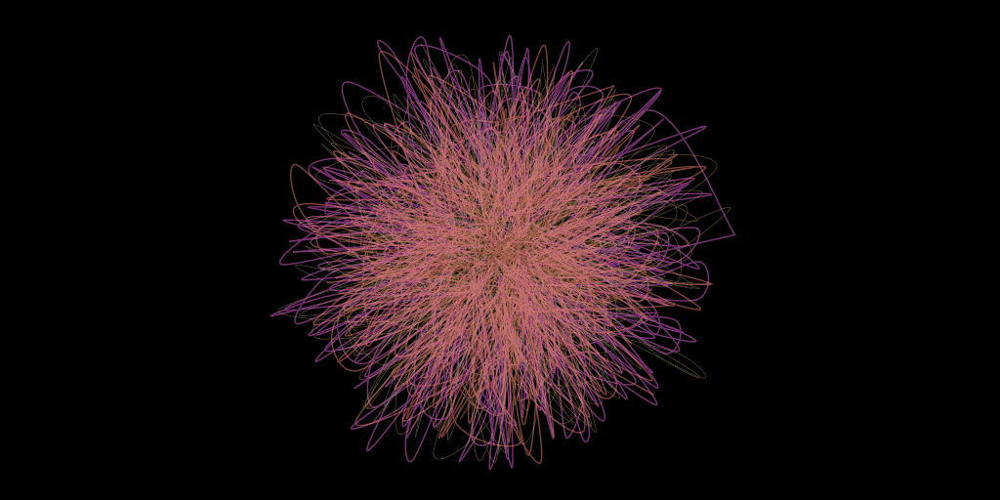

# Complexity

Complexity in creative coding and generative art arises from the application of simple rules to create intricate and often unpredictable outcomes. By leveraging basic algorithms or rule-based systems, artists can generate complex structures, patterns, and behaviors that far exceed the simplicity of their foundational elements. This approach mirrors natural processes where simple laws of physics or biology give rise to the diversity of forms and systems observed in nature.

In generative art, small changes to initial conditions or rules can lead to vastly different outcomes. This allows for exploration within a controlled yet flexible framework. The interplay between simplicity and complexity not only challenges the artist to think critically about the underlying systems but also offers a rich playground for creativity, where emergent properties and patterns can be discovered, refined, and used to craft deeply intricate works of art.

## Examples

In this example, a simple set of rules creates a basic shape. A slight perturbation is applied in each successive generation to create a complex form:

This childlike scribble was made using an L-system that generates curved lines, with some noise added to give it an organic look:

