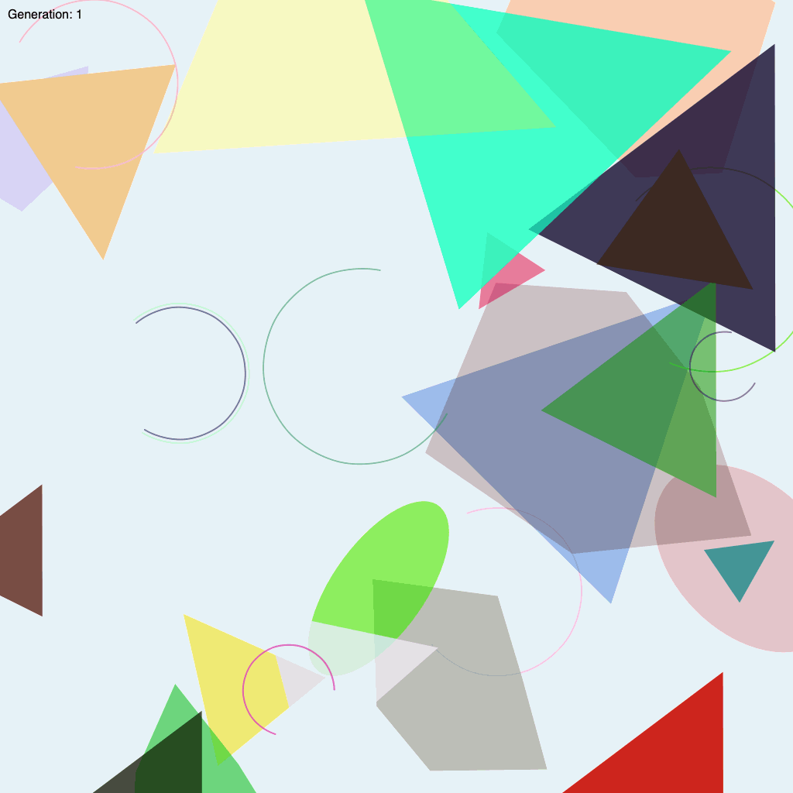

# Evolution

Evolution in generative art draws inspiration from natural processes to create artworks that evolve over time. Genetic algorithms mirror concepts like survival of the fittest. By simulating evolutionary principles, artists can develop algorithms that "breed" new generations of designs, selecting and mutating them based on specific criteria or randomness. This process allows for the gradual refinement and emergence of complex forms, patterns, or behaviors that are continually evolving.

Just as in nature, where organisms adapt to their environment, these generative systems evolve to produce outcomes that are both unexpected and rich in diversity. This evolutionary approach not only introduces a dynamic, organic quality to the creative process but also opens up endless possibilities for innovation, as each iteration can lead to new, unforeseen artistic directions.

## Examples

In this example, a random population of shapes gradually evolves, converging upon a particular shape and colour:

