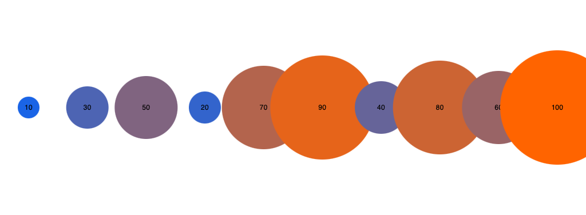
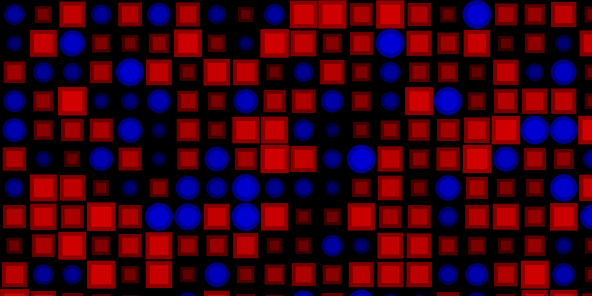
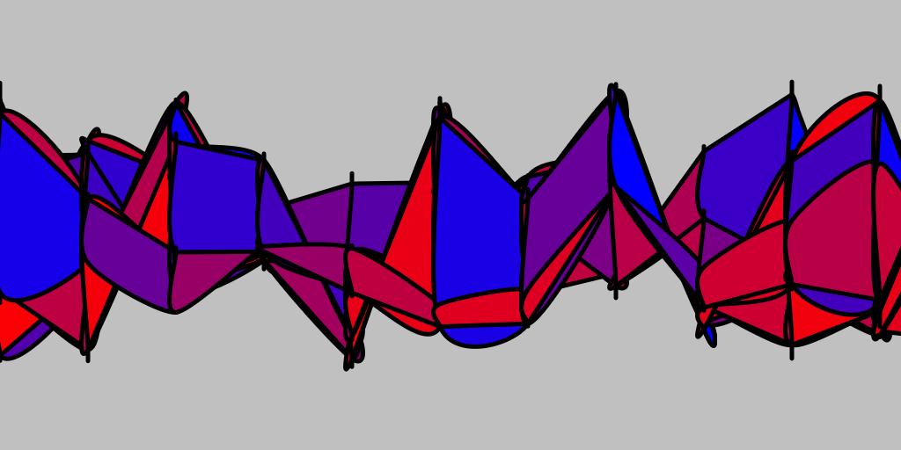

# Mapping and Representation

In creative coding, mapping and data representation are fundamental processes that bridge the gap between raw computational outputs and their artistic expressions. At the heart of generative work lies data — often the result of complex algorithms and mathematical functions — that serves as the driving force behind the creative work.

Computers excel at producing streams of data, whether through noise functions, random number generation, or more sophisticated models. However, creativity in generative art often emerges in the mapping process, where this data is translated into formal outputs. This transformation is where the artist's vision comes to life, as numerical values are reinterpreted into visual forms, spatial structures, auditory experiences, or other sensory outputs.

The same set of data can yield vastly different results depending on how it's mapped, whether it’s used to shape a digital landscape, generate abstract geometries, or compose a piece of music. Thus, mapping is not merely a technical step but a creative act, where the interpretation of data becomes a medium of artistic expression, unlocking new possibilities for exploring form, texture, and pattern in digital art.

## Examples

In this example, numbers are mapped to the size and colour of each circle:

Here we map, say, temperature data to shapes and colours:

Or in a more abstract sense:

