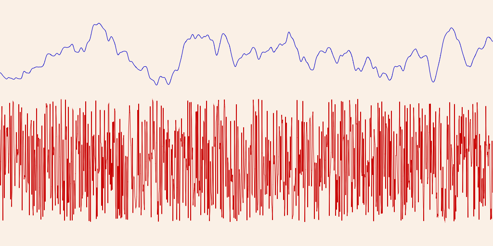
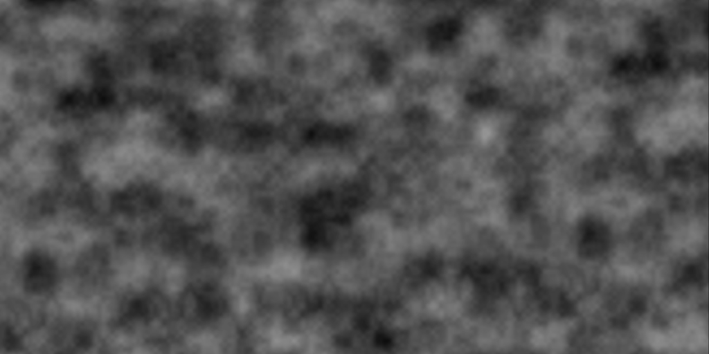

# Noise

In generative art and computer graphics, noise plays a crucial role in creating more natural and visually appealing randomness.

While pure randomness is often used in computational modeling and simulations to introduce variation, it can produce results that feel chaotic and unnatural, such as the static seen on a TV screen. To address this, noise is introduced as a form of "smooth randomness," which maintains local coherence and allows for the extraction of discernible patterns. This smooth randomness is achieved either by smoothing a random sequence or by adding disturbances to an otherwise smooth sequence. The most notable example of this approach is Perlin Noise, widely used in computer graphics to generate organic textures, terrains, and other procedural elements that require a more natural variation.

By using noise, artists and developers can create complex, yet coherent visuals that mimic the subtle variations found in nature.

## How is noise generated?

Generally speaking, the generation of noise can be approached in one of two ways: smoothing a random sequence, or introducing disturbance into a smooth sequence. A notable example of noise used in computer graphics is Perlin noise.

## Examples

This example shows a 1-dimensional random sequence (red line) contrasted with smooth randomness (blue line):

This cloudlike texture was created using 2-dimensional Perlin noise:

