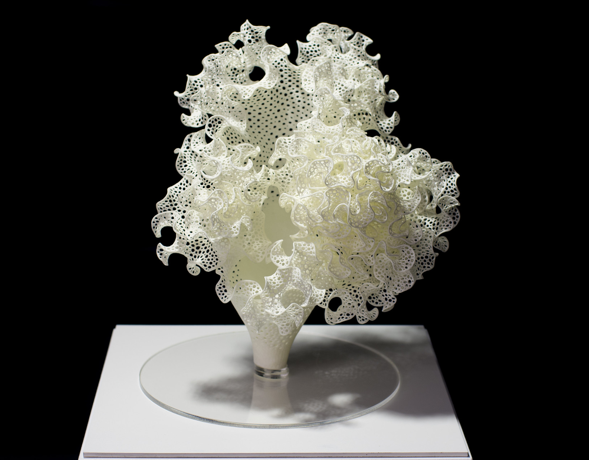

# Differential Growth

Image credit: [Credit: Ars Electronica / Christopher Sonnleitner on flickr.com](https://www.flickr.com/photos/arselectronica/34563904231)

The wide variety of complex shapes exhibited by plants and other living organisms –_organic shapes_– emerges through a process called morphogenesis. Differential growth (DG) is the main mechanism driving the formation of these intricate shapes and patterns, and as the name indicates, it can be defined as the the carefully regulated process through which cells subdivide and differentiate from each other. However, and despite large efforts into understanding how differential growth is regulated via the influence of genetic and environmental forces, it's guiding principles remain largely unknown ([1](#1)).

Nevertheless, DG-simulations are relatively easy to implement in software, as following a set of simple rules

## How it works

To explain how differential growth behaviour can be simulated, the metaphor of a rope of interconnected nodes is the most common approach. In this rope, each node follows two rules:

- Separation: Try not to collide with other surrounding nodes.
- Cohesion: Try to stay close to surrounding nodes.

Additionally, when the length of _rope_ between two consecutive nodes exceeds a certain threshold, a new node is added on the mid-point of said section of _rope_. This is how the rope _grows_.

## A live example

You can play around with the parameters on the right hand side.

<iframe height="500" style="width: 90%" scrolling="no" title="Differential growth" src="https://codesandbox.io/embed/github/GenArtRepo/differential-growth/tree/main/?fontsize=14&hidenavigation=1&theme=dark?module=sketch.js" frameborder="no" loading="lazy" allowtransparency="true" allowfullscreen="true"></iframe>

## Applications and examples

There are many examples of generative art that use differential-growth algorithms, ranging from simple 2D patterns to complex 3D sculptures. Some artists use color or texture to add further complexity and visual interest to the generated structures. Here are a few examples:

- "Differential Growth" by Raven Kwok: A series of abstract 3D sculptures that combine smooth curves and sharp angles to create intricate structures.
- "Living Segments" by Memo Akten: A 2D pattern that simulates the growth and branching of plant cells, with each segment responding to its neighbors and the environment.

- ["Xylem and Hyphae"](https://n-e-r-v-o-u-s.com/projects/sets/networks/) by N-e-r-v-o-u-s System: A series of 3D sculptures and installations inspired by the rhizomatic patterns found in fungi and coral.

## References

1. Huang, C. **et al** (2018) Differential growth and shape formation in plant organs. Proceedings of the National Academy of Sciences 115(49) [(accessed here)](https://www.pnas.org/doi/10.1073/pnas.1811296115)

2. Hoff, A. On Generative Algorithms - Differential Line [(accessed here)](https://inconvergent.net/generative/differential-line/)
