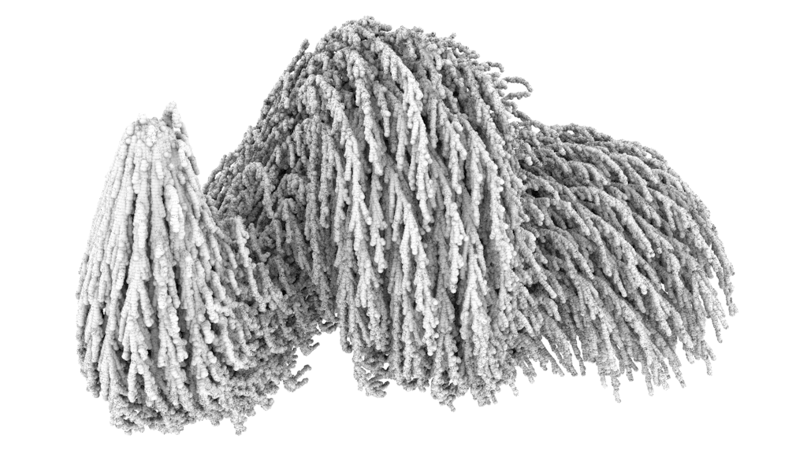

---

title: Diffusion-limited Aggregation

type: example

description: 

code: Cristian Rojas Cardenas

author: Camilo Cruz Gambardella

rights: Public Domain (CC0)

thumbnail: imgs/dla_thumb.png

tags: random walk, agent-based, self-similarity, fractals

---

# Diffusion-limited Aggregation

Image credit: [Karsten Schmidt](https://commons.wikimedia.org/wiki/File:DLA_spiral.png)

Diffusion-limited aggregation (DLA) is a process of fractal pattern formation in which an initially randomly distributed set of moving particles stick together –aggregate– as they come into contact with one another. First formulated by Witten and Sander [1](#1), and further studied by a large number of authors (see [2](#2) for further references), DLA models have been used to describe natural phenomena that display interesting and complex geometric configurations, such as the formation of snow flakes and stalactites, as well as the path taken by lightning.

## How it works

At its simplest, a DLA simulation begins by populating a two-dimensional “space” with a set of randomly distributed particles. One of the particles is labelled as the *seed*, and is made stationary. The rest of the particles then diffuses –moves randomly through the space. When a particle encounters the seed, it as well becomes stationary, forming a cluster. The process is then repeated, whereby newly formed clusters serve as seed for the remaining moving particles.

## A live example

<iframe height="500" style="width: 90%" scrolling="no" title="Differential growth" src="https://codesandbox.io/embed/github/GenArtRepo/dla/tree/main/?fontsize=14&hidenavigation=1&theme=dark?module=sketch.js" frameborder="no" loading="lazy" allowtransparency="true" allowfullscreen="true"></iframe>

## Related entries

## References

1. <a name="1">[Witten Jr, T. A., & Sander, L. M. (1981). *Diffusion-limited aggregation, a kinetic critical phenomenon*. Physical review letters, 47(19), 1400.](http://ancient.hydro.nsc.ru/MPP_Specourse/witten81.pdf)</a>

2. <a name="2">[Bourke, P. (2004) DLA - Diffusion Limited Aggregation](http://paulbourke.net/fractals/dla/)</a>