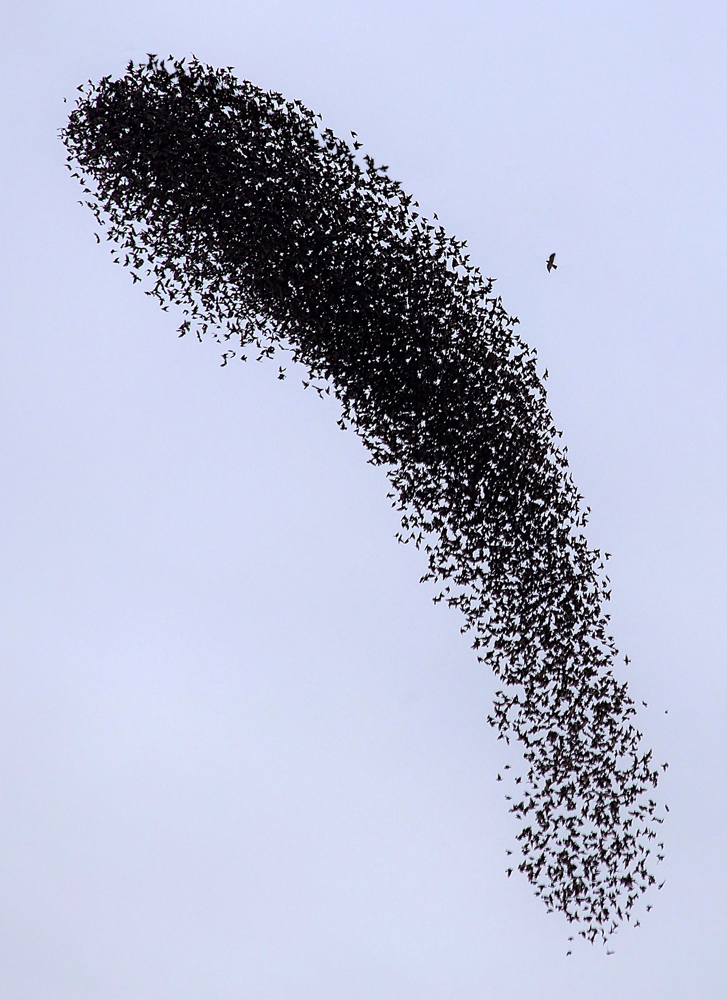

# Flocking

Image credit: [Mostafa Meraji (Mostafameraji)](https://commons.wikimedia.org/wiki/File:Starling_flock_with_nearby_predator.jpg)

As observed in nature, flocking is an example of distributed behaviour, where large groups of individual agents (birds) seem to operate as a unit without hierarchical direction. A computational simulation of this behaviour can be created using the steering behaviours developed by Craig W. Reynolds ([1](#1))

## How it works

Each agent in a simulated flock operates under three principles:

### Separation:

Check for all other agents within a certain distance range and try to get away from them.

### Alignment:

Check for all other agents within a certain distance and try to align heading to the average heading of those neighbours.

### Cohesion:

Check for all other agents within a given distance range, and try to move towards their average position.

## A live example

In the example shown below, different weights can be assigned to each individual behaviour, to create variation in the overall behaviour of the flock.

<iframe height="500" style="width: 100%" scrolling="no" title="Slime Mould Simulations" src="https://codesandbox.io/embed/github/GenArtRepo/flocking/tree/main/?fontsize=14&hidenavigation=1&theme=dark&module=sketch.js" frameborder="no" loading="lazy" allowtransparency="true" allowfullscreen="true"></iframe>

## References

1. Reynolds, C. W. (1999, March). [Steering behaviors for autonomous characters.](https://citeseerx.ist.psu.edu/viewdoc/download?doi=10.1.1.86.636&rep=rep1&type=pdf) In Game developers conference (Vol. 1999, pp. 763-782).

2. Reynolds, C. W. (1987, August). [Flocks, herds and schools: A distributed behavioral model.](http://www.naturewizard.at/papers/flocks%20-%20p25-reynolds.pdf) In Proceedings of the 14th annual conference on Computer graphics and interactive techniques (pp. 25-34).