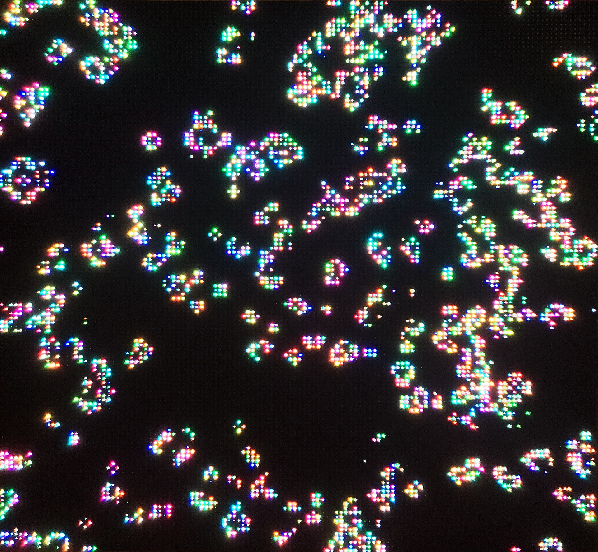

# John Conway's Game of Life

<!--  -->
[Conways Game of Life on a LED Matrix]

Image credit: [Simon Waldherr on commons.wikimedia.org](https://commons.wikimedia.org/wiki/User:SimonWaldherr)

Developed by John Conway as a mathematical game [1], _life_ is a [cellular automaton](../../algorithms/cellular-automata/index.md) that, despite its simple rules, is capable of producing a large variety of complex shapes and behaviours.

## How it works

As suggested by the name, _life_ draws concepts from naturally occurring phenomena to define the behaviour of _organisms_ living on a grid that is updated in discrete time steps. On the grid, each cell has eight neighbours, and can be either dead or alive. The state of the cells are updated syncronously based on the following rules:
- If a cell is alive:
  - and it has 2 or 3 live neighbours, the cell stays alive.
  - Otherwise, the cell dies.
- If a cell is dead, but has exactly 3 live neighbours, it'll come to life in the next time step.

## A live example

<iframe height="500" style="width: 900px" scrolling="no" title="Game of Life" src="https://editor.p5js.org/GenArtRepo/sketches/eApzAakXq" frameborder="no" loading="lazy" allowtransparency="true" allowfullscreen="true"></iframe>

## References

1. Gardner, M. (1970) Mathematical Games, The fantastic combinations of John Conway's new solitaire game _"life"_.