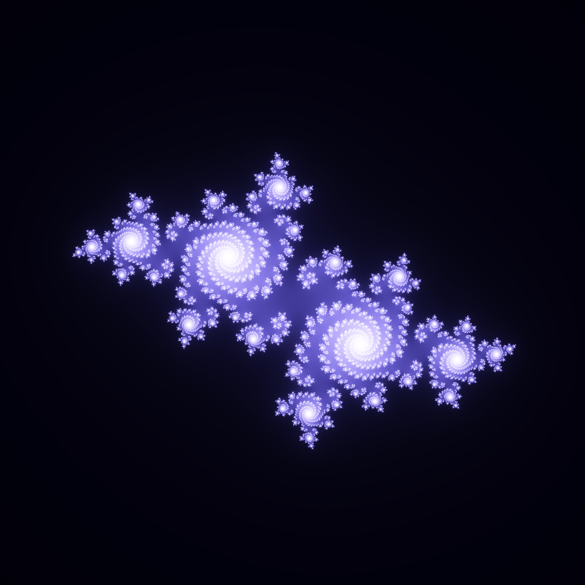

# Julia Sets

Image credit: [Dominic Alves on flikr.com](https://www.flickr.com/photos/dominicspics/5419214031)

Julia sets are mathematical shapes that come from the complex plane, using simple formulas to create incredibly detailed and often chaotic images. These fractals are based on iterative functions, where a point on the plane is repeatedly plugged into the formula. Depending on the formula and the starting point, the shapes can range from simple, smooth curves to complex, swirling patterns. Artists and mathematicians alike are drawn to Julia sets for their ability to generate endlessly unique and visually striking designs, making them a perfect fit for generative art projects. The resulting images can look organic or otherworldly, blurring the lines between natural forms and mathematical precision.

## A live example

<iframe height="500" style="width: 100%" scrolling="no" title="Julia Sets" src="https://codesandbox.io/embed/github/GenArtRepo/julia-set/tree/main/?fontsize=14&hidenavigation=1&theme=dark?module=sketch.js" frameborder="no" loading="lazy" allowtransparency="true" allowfullscreen="true"></iframe>

## References

1. [Understanding Julia and Mandelbrot sets - Karl Sims](https://www.karlsims.com/julia.html)
