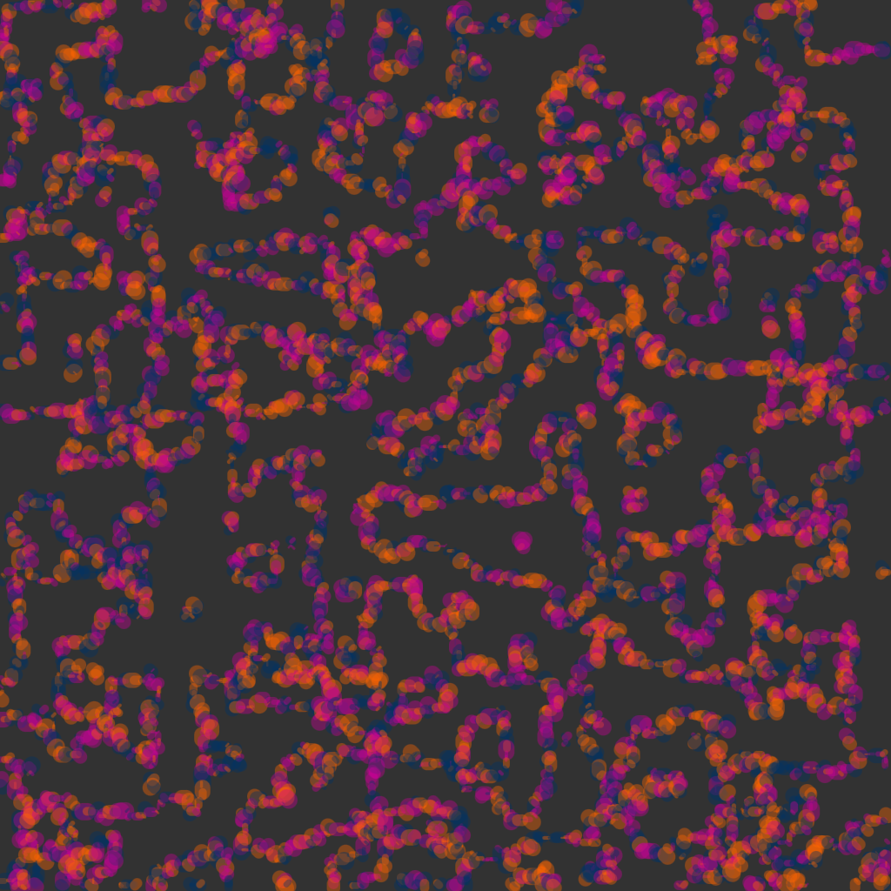

# Marching Squares

The Marching Squares algorithm is a method used in computer graphics to draw smooth outlines or shapes from data points on a grid. It looks at the values at the corners of each square on the grid and uses those values to decide what the shape inside the square should look like. This is useful in generative art, where it can create flowing, natural-looking shapes like waves, mountains, or other patterns. By changing the values that the algorithm uses, you can create a wide variety of interesting and complex designs. Many artists and developers use this technique to make beautiful, dynamic visual patterns in creative coding projects.

## How it works

Starting with a 2D grid of data points, each grid cell is assigned a value, and the algorithm “marches” through these cells, checking how values at the corners relate to a threshold. Depending on how the values are distributed (above or below the threshold), a contour line is drawn inside the cell. By doing this across the entire grid, the algorithm forms continuous curves that outline areas of similar values.

## A live example

<iframe height="500" style="width: 90%" scrolling="no" title="L-System" src="https://codesandbox.io/embed/jjw775?view=split&module=%2Fsketch.js&hidenavigation=1" frameborder="no" loading="lazy" allowtransparency="true" allowfullscreen="true"></iframe>

## Examples

This image was made using the marching squares algorithm, with circles of varying colours and sizes applied to create an abstract visual:

