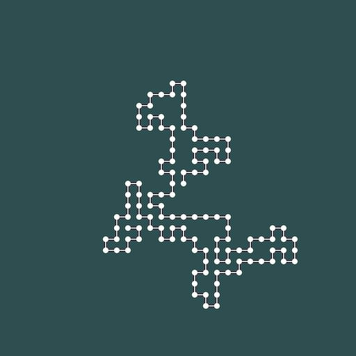
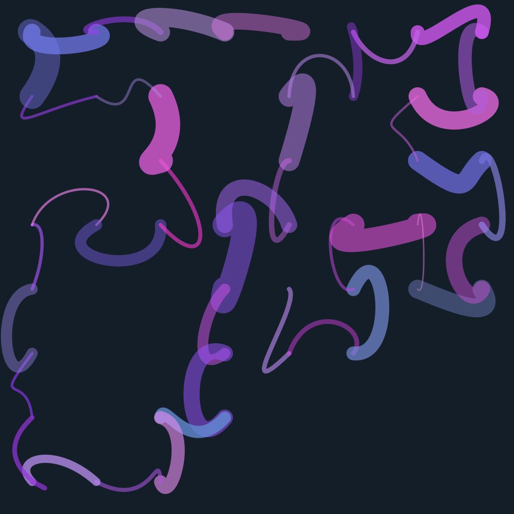

# Self-Avoiding Walk

A self-avoiding walk (SAW) is a path that moves step by step through a grid, ensuring that no point is visited more than once. It starts at a given position, and at each step, it moves randomly to a neighboring position, checking to make sure it hasn’t been there before. This simple rule creates intricate, complex patterns that grow organically, making it ideal for generative art. The challenge comes from the fact that the longer the path gets, the harder it becomes to find new directions without crossing the path’s own trail. As a result, a SAW often produces delicate, unpredictable forms that are both structured and chaotic. This method can be used to generate unique visualizations, bringing mathematical and artistic concepts together.

## How it works

In a self-avoiding walk (SAW), the goal is to construct a sequence of moves on a grid (typically a square lattice in 2D) where no position is revisited. Formally, if the walk is described by a sequence of points $(x_0, y_0), (x_1, y_1), \dots, (x_n, y_n)$, then each point must satisfy the condition $(x_i, y_i) \neq (x_j, y_j)$ for all $i \neq j$. The walk begins at an initial point $(x_0, y_0)$, and at each step, it randomly selects a neighboring point $(x_{i+1}, y_{i+1})$ that has not been visited before. If no valid moves are possible, the walk terminates.

Mathematically, a walk's probability space becomes more constrained as it progresses, with each step reducing the number of available moves. The number of self-avoiding walks of length $n$ on a $d$-dimensional lattice is denoted as $C_n$, which grows exponentially with $n$, though exact formulas for $C_n$ are difficult to obtain. In two dimensions, the asymptotic behavior of $C_n$ is approximated by $C_n \sim \mu^n n^{\gamma - 1}$, where $\mu$ is the lattice-dependent growth constant, and $\gamma$ is a critical exponent. This complexity makes the SAW algorithm an interesting tool for generating non-repeating patterns in generative art.

## Examples

Here we see a self-avoiding walk used as the basis for an abstract piece, where curved lines are drawn between grid points:

