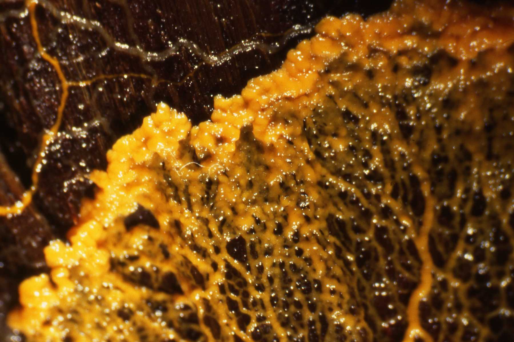

# Slime Mold Simulation

Image Credit: [Helen Ginger](https://commons.wikimedia.org/wiki/User:HelenGinger)

Slime mold is the informal name of a group of organisms that are usually found in aggregated form, displaying complex multicellular reproductive configurations.

