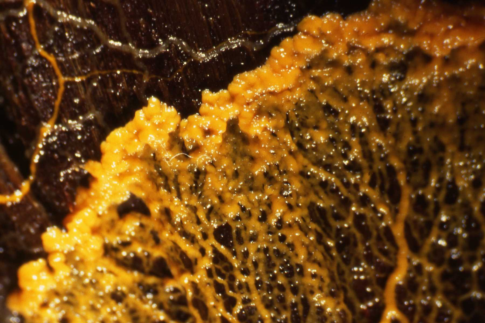

# Slime Mold Simulation

Image Credit: [Helen Ginger](https://commons.wikimedia.org/wiki/User:HelenGinger)

Slime mould is the informal name of a group of organisms that are usually found in aggregated form, displaying complex multicellular reproductive configurations. The slime mould simulation algorithm mimics the behavior of real slime molds as they explore and connect to their environment. This algorithm creates intricate, organic patterns that resemble networks or webs.

## How it works

The slime mould simulation algorithm is inspired by the way slime molds find the most efficient paths between food sources. In the algorithm, agents represent slime mold cells, and they move based on local rules—seeking out areas of high "food" concentration or chemical trails left by others. As these agents explore, they leave behind a trail, which builds up over time to form complex, branching structures.

Interestingly, this movement shares similarities with [flocking simulations](../flocking/), where agents (like birds or fish) follow simple rules to move together as a group. Both systems rely on individual behaviors—such as attraction, repulsion, or alignment—to generate emergent patterns at a larger scale. Adjusting parameters like movement speed, trail decay, or the number of agents can drastically change the visual result, creating anything from delicate, web-like formations to dense, organic clusters.

This simulation captures how simple rules can give rise to intricate, natural-looking patterns often used in generative art.

## A live example

<iframe height="500" style="width: 100%" scrolling="no" title="Slime Mould Simulations" src="https://codesandbox.io/embed/github/GenArtRepo/slime-mould-simulation/tree/main/?fontsize=14&hidenavigation=1&theme=dark&module=sketch.js" frameborder="no" loading="lazy" allowtransparency="true" allowfullscreen="true"></iframe>
