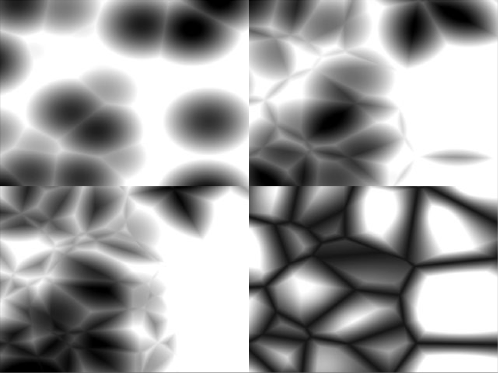

# Worley Noise

Introduced by Steven Worley in 1996 [1] as a method to create natural-looking procedural textures in computer graphics, Worley noise uses an approach similar to the Voronoi diagram, where randomly distributed seed points – feature points – define areas in 2D or 3D space, which in turn define the colour information for every other point in that space. This produces textures that resemble stone, water, crystals and other microscopic cellular structures.

## How it works

The Worley noise algorithm generates patterns by focusing on how far a point in space is from its closest "feature point," which is randomly placed. The algorithm divides the space into cells, each containing a random point, and calculates the distance from any given location to the nearest point in the surrounding cells. These distances can then be visualized as a series of smooth transitions or abrupt boundaries, depending on how the data is used.

This approach is particularly useful for generating textures that mimic natural forms, like the irregular patterns of cracked earth, veins in marble, or the organic structures found in plants and animal skins. Worley noise is often used in 3D modeling, procedural generation, and abstract generative art because of its ability to create complex and organic-looking visuals with simple rules.

## A live example

<iframe height="500" style="width: 90%" scrolling="no" title="Worley Noise" src="https://codesandbox.io/embed/github/GenArtRepo/worley-noise/tree/main/?fontsize=14&hidenavigation=1&theme=dark?module=sketch.js" frameborder="no" loading="lazy" allowtransparency="true" allowfullscreen="true"></iframe>

## References

1. Worley, S. (1996) A Cellular Texture Basis Function. Proceedings of the 23rd annual conference on Computer graphics and interactive techniques (pp. 291-294) [(accessed here)](https://dl.acm.org/doi/pdf/10.1145/237170.237267)
